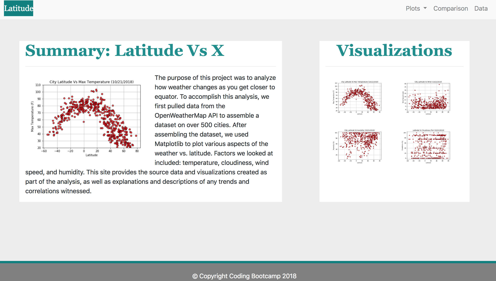

# Web-Weather

This project takes Python requests, APIs, and JSON traversals to answer a fundamental question: "What's the weather like as we approach the equator?" and Python script to visualize the weather of 500+ randomly selected unique cities across the world of varying distance from the equator. 

The website is built from scratch using HTML, Bootstrap & CSS: https://madhavi-r.github.io/Web-Weather/

 
